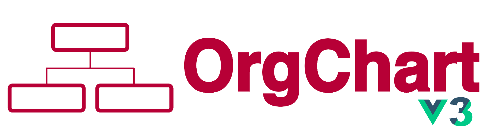

<div style="display-flex flex-row">  
    
    
    
  <a href="https://github.com/augustinribreau/vue3-organization-chart/graphs/commit-activity" target="_blank">  
      
  </a> 

## Foreword
- First of all, thank you very much for the excellent work of [dabeng](https://github.com/dabeng). I'm just adding my sauce to move the project to Vue3
- **It work's with VueJS 3 !**

# Installation
```  
npm install vue3-organization-chart --save  
```  

# Demos
```  
Since codesandbox and jsfiddle can't get vue3 to work properly. I am currently developing a doc.  
```  

# Usage
```html  
<template>
  <div>
    <organization-chart :datasource="ds"></organization-chart>
  </div>
</template>

<script>
  import OrganizationChart from 'vue3-organization-chart'
  import 'vue3-organization-chart/dist/orgchart.css'
  export default {
    components: {
      OrganizationChart
    },
    data () {
      return {
        ds: {
          'id': '1',
          'name': 'Lao Lao',
          'title': 'general manager',
          'children': [
            { 'id': '2', 'name': 'Bo Miao', 'title': 'department manager' },
            { 'id': '3', 'name': 'Su Miao', 'title': 'department manager',
              'children': [
                { 'id': '4', 'name': 'Tie Hua', 'title': 'senior engineer' },
                { 'id': '5', 'name': 'Hei Hei', 'title': 'senior engineer',
                  'children': [
                    { 'id': '6', 'name': 'Pang Pang', 'title': 'engineer' },
                    { 'id': '7', 'name': 'Xiang Xiang', 'title': 'UE engineer' }
                  ]
                 }
               ]
             },
            { 'id': '8', 'name': 'Hong Miao', 'title': 'department manager' },
            { 'id': '9', 'name': 'Chun Miao', 'title': 'department manager' }
          ]
        }
      }
    }
  }
</script>
```  

# Attributes
<table>  
  <thead>  
    <tr><th>Name</th><th>Type</th><th>Required</th><th>Default</th><th>Description</th></tr>  
  </thead>  
  <tbody>  
    <tr>  
      <td>datasource</td><td>json</td><td>yes</td><td></td><td>datasource usded to build out structure of orgchart. It could be a json object.</td>  
    </tr>  
    <tr>  
      <td>pan</td><td>boolean</td><td>no</td><td>false</td><td>Users could pan the orgchart by mouse drag&drop if they enable this attribute.</td>  
    </tr>  
    <tr>  
      <td>zoom</td><td>boolean</td><td>no</td><td>false</td><td>Users could zoomin/zoomout the orgchart by mouse wheel if they enable this attribute.</td>  
    </tr>  
    <tr>  
      <td>zoomin-limit</td><td>number</td><td>no</td><td>7</td><td>Users are allowed to set a zoom-in limit.</td>  
    </tr>  
    <tr>  
      <td>zoomout-limit</td><td>number</td><td>no</td><td>0.5</td><td>Users are allowed to set a zoom-out limit.</td>  
    </tr>  
  </tbody>  
</table>  

# Events
<table>  
  <thead>  
    <tr><th>Name</th><th>Parameters</th><th>Description</th></tr>  
  </thead>  
  <tbody>  
    <tr>  
      <td>node-click</td><td>node data</td><td>triggers when user clicks the node.</td>  
    </tr>  
  </tbody>  
</table>  

# Scoped Slots
```html  
<template slot-scope="{ nodeData }">  
 <!-- feel free to customize the internal structure of node --></template>  
```

## Author

👤 **Augustin Ribreau**
* Website: https://augustinribreau.com/
* GitHub: [@augustinribreau](https://github.com/augustinribreau)  
